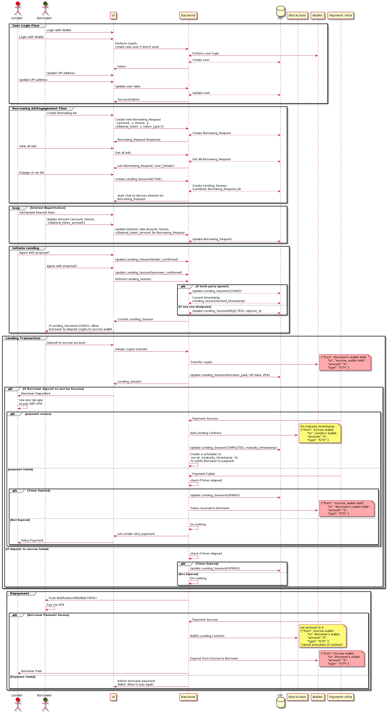
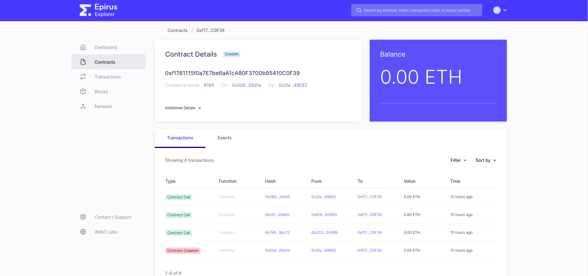
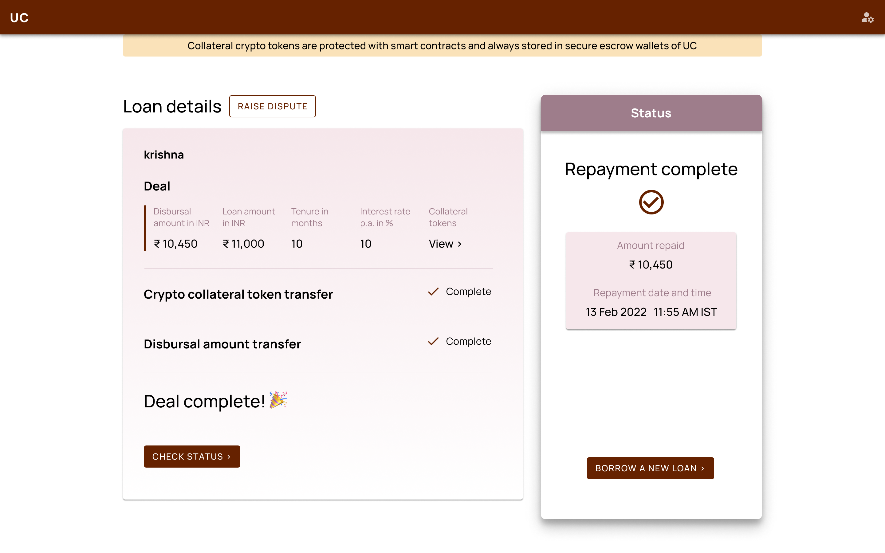
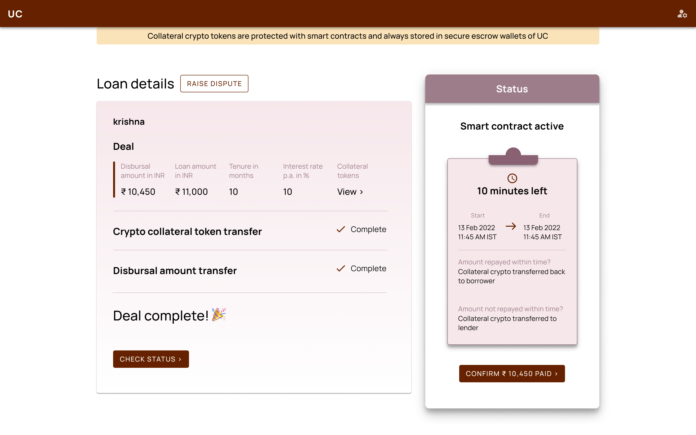
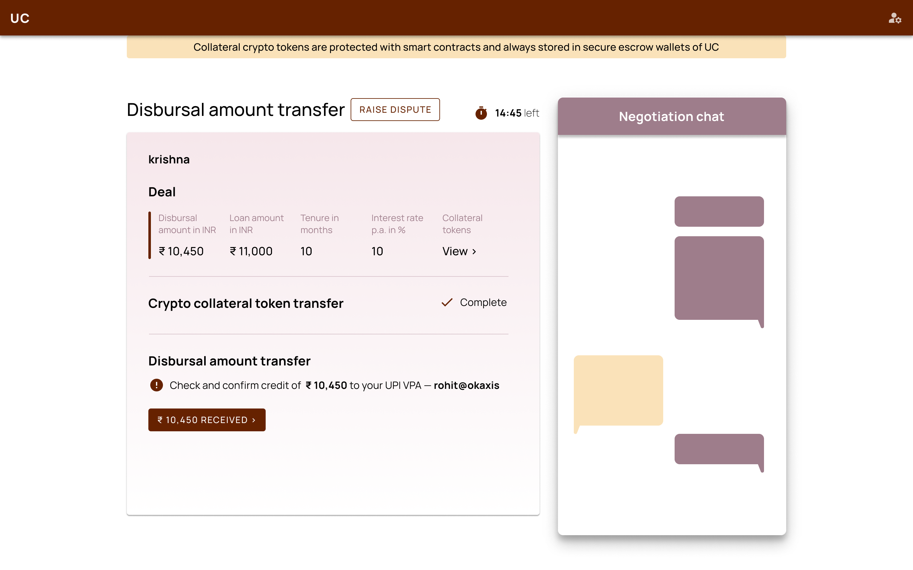
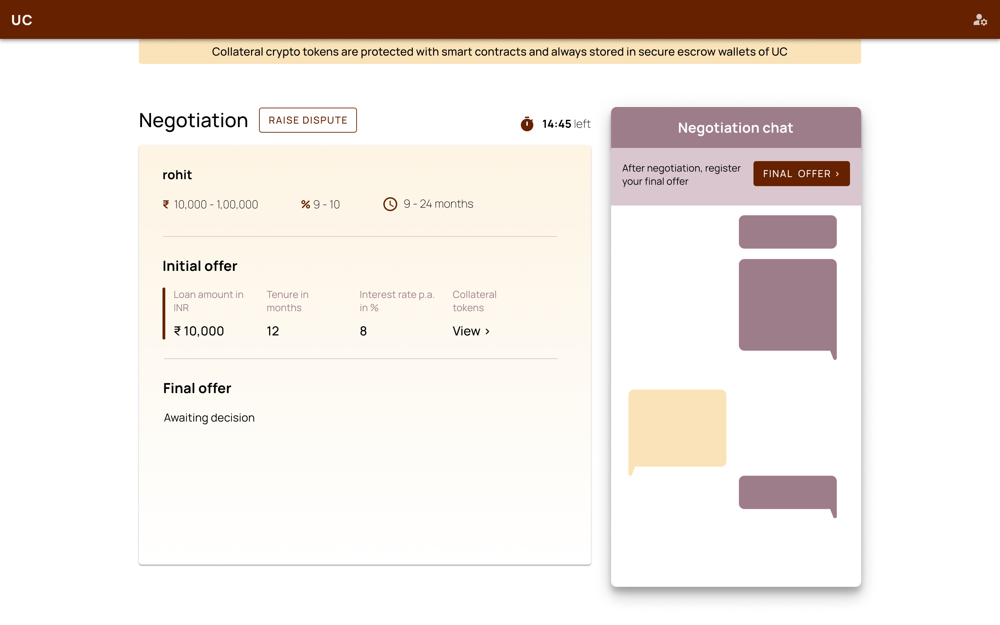
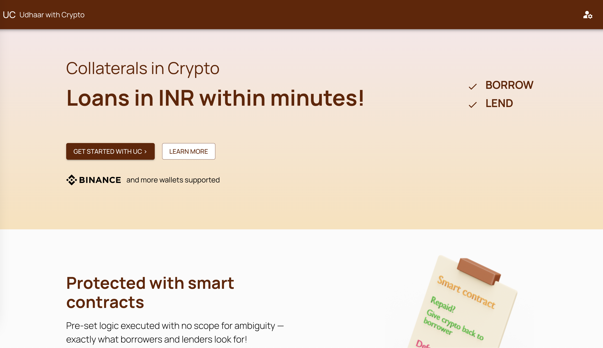

# Crypto Lending Service

Lend money(fiat currency) with Cryptocurrency as collateral on ethereum blockchain as source of trust.
We connect lenders to borrowers in a P2P Defi manner, where borrower provides crypto collateral to get a loan, and outcome of this loan (`borrower-defaulted`, `borrower-repaid`, `dispute`) is being governed by a samrt contract which we create when loan has been disbursed.

- Currency supported : `MATIC`, `ETH`

## Setup:
1. Start `geth` the private blockchain:
    ```sh
    cd geth
    docker-compose up -d
    ```
2. [Optional] Setup blockchain server monitoring:
    ```sh
    cd geth-monitoring
    # set NODE_ENDPOINT vars to your geth server endpoint(default: http://localhost:8545)
    docker-compose up -d
    ```
- UI will be available at: http://localhost:8081

3. Start backend and Database:
    ```sh
    cd app
    # update configuration if needed in .env
    source .env
    docker-compose up -d
    ```

4. Start Crypto-Lending UI:
    ```sh
    cd ui-code 
    yarn
    yarn start
    ```

### Communication between components:



### Features List:
- Build private blockchain to test on. -- Done
- Transfer of lender's collateralized tokens to a secured wallet -- Done(Binance API)
- Smart contract creation on private blockchain and execution -- Done
- Transfer of amount borrowed minus interest in a seamless manner into borrower's wallet --Done
- Real-time chatbot between lenders and borrowers -- Done
- Private blockchain monitoring -- Done
- Consensus algo for handling private chain -- Done. (On mainnet it'll be handled by Oracles)
- Portfolio import from any crypto exchange -- Pending
- Setup fiat money payment and verify payments -- Pending
- Can expose borrowers' and lenders' both crypto wallet history to full proof and provide more info on each other. -- Pending
- Rollover of loans in worst case scenario - being-discussed.
- Cashing out of crypto to FIAT currency against collateral seized -- being-discussed.

### MVP Scope:
- Built on private blockchain.
- Only one wallet support
- 0 gas fees for contract execution


### Screenshots:
1. Private blockchain viewer:


2. UI:







